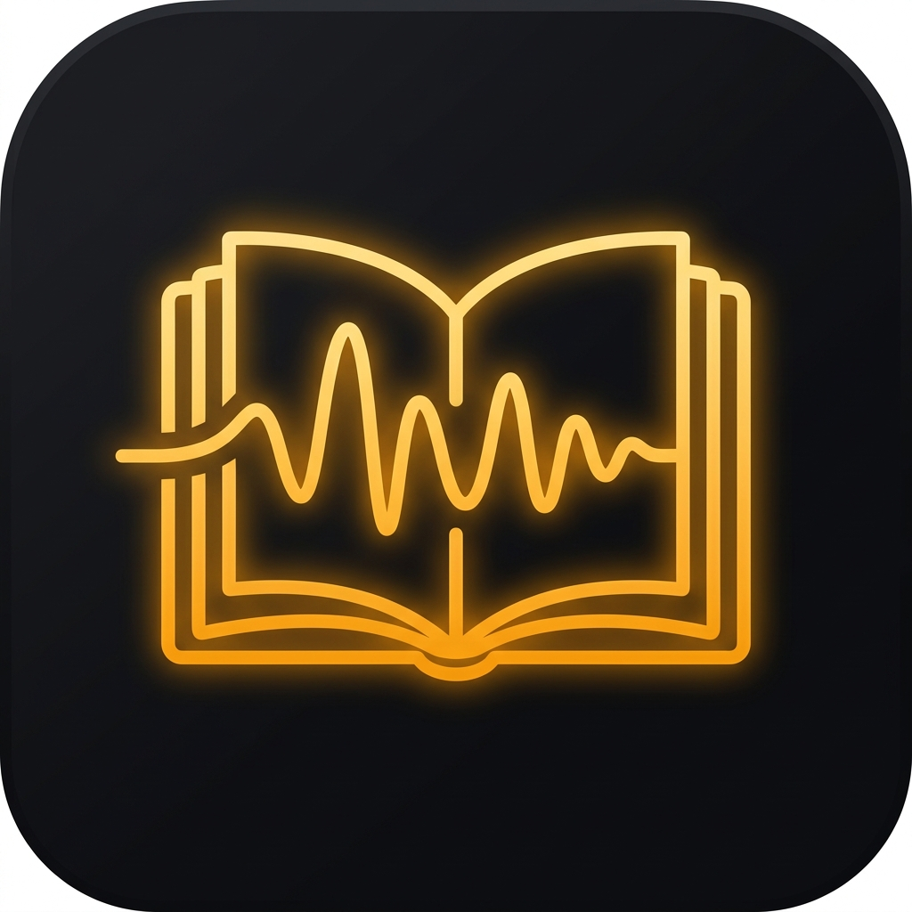

# Neural Novel TTS 🎧📖

  
  <h3>Offline, High-Fidelity Text-to-Speech Web Novel Reader for Android</h3>
  
Smooth, human-like neural voices with zero-gap paragraph playback.

---

## 🌟 Key Highlights

- **Instant Zero-Download Playback**: Features a **Hybrid TTS Engine**. Works 100% offline out-of-the-box on first launch using your device's built-in Android System TTS with zero downloads required!
- **Optional Kokoro-82M Neural Voice**: Upgrade anytime to studio-quality neural voices with a resumable (HTTP `Range`), auto-retrying chunked downloader that persists cleanly across app restarts.
- **Zero-Gap Paragraph Audio**: Seamless lookahead synthesis queue feeds continuous audio, eliminating the awkward 1-2 second pauses between paragraphs found in other apps.
- **Sample-Accurate Text Highlighting**: Real-time sentence tracking synced with playback head frames for accurate karaoke-style auto-scrolling.
- **Universal Web Novel Scraper**: Automatically extracts story chapters, filters out reader comments and navigation chrome, and auto-detects "Next Chapter" links for offline pre-fetching.
- **Clustered Speed Controls**: Compact speed button opening an expandable menu with presets (0.5x to 2.5x) and a fine-tuning slider.
- **Screen-Off Background Playback**: Android `ForegroundService` with `PARTIAL_WAKE_LOCK` and `MediaSessionCompat` lock screen controls.
- **Obsidian Amber Theme**: Eye-friendly dark mode interface (`#121214` background with glowing `#F59E0B` amber accents).
- **Android 9+ Compatibility**: Designed to run seamlessly on older and newer devices alike (API 28+).

---

## 📱 How to Build in Android Studio

1. **Open Project**: Launch Android Studio, select **Open**, and navigate to this repository folder.
2. **Gradle Sync**: Let Android Studio complete the initial Gradle sync.
3. **Run**: Connect your Android 9+ phone or emulator and click **Run 'app'** (`Shift + F10`).
4. **Generate APK**: In the top menu, click **Build** $\rightarrow$ **Build Bundle(s) / APK(s)** $\rightarrow$ **Build APK(s)**.

---

## 📂 Architecture Overview

- `com.tts.reader.data.scraper.NovelScraper`: Targeted Ranobes / web novel extractor with comment sanitization.
- `com.tts.reader.data.local`: Room Database for offline chapter caching and resume progress.
- `com.tts.reader.tts.ModelManager`: Resilient one-tap first-run downloader for Kokoro ONNX model weights.
- `com.tts.reader.tts.AudioStreamPipeline`: Streaming `AudioTrack` lookahead audio pipeline with sample-accurate highlight sync.
- `com.tts.reader.service.PlaybackService`: Background playback service with lock-screen notification and wake locks.
- `com.tts.reader.ui`: Jetpack Compose UI with locked Obsidian Amber theme.
